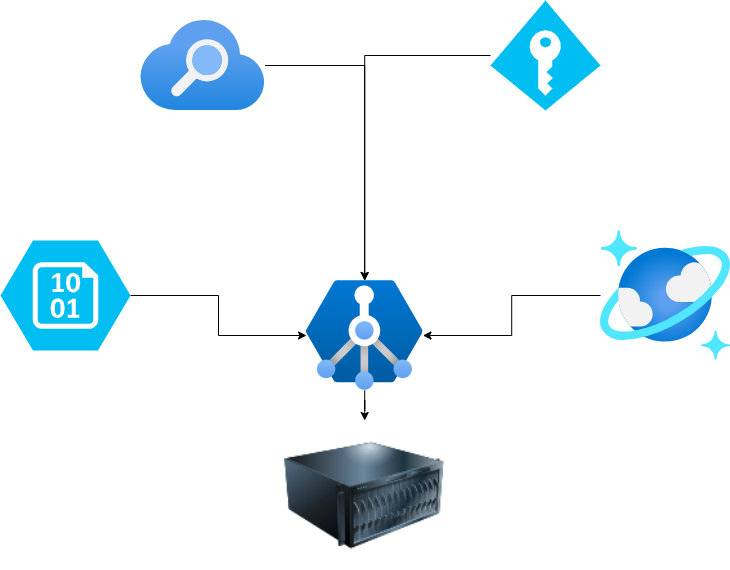

# Azure Full Stack App

Modern Python web uygulaması için Azure altyapısı ve ücretsiz katman hizmetlerini kullanarak tam entegre çözüm.

## 🏗️ Architecture



## 📋 Azure Services

| Service | Tier | Quota |
|---------|------|--------|
| **App Service** | F1 (Free) | 1 GB RAM, 1 GB storage |
| **Storage Account** | Standard LRS | Hot storage, file shares |
| **Cosmos DB** | Free tier | 25 GB, 1000 RU/s |
| **Cognitive Search** | Free | 50 MB storage, 3 indexes |

## 🚀 Quick Deploy

### Prerequisites
- Azure CLI installed
- Azure subscription with free credits

### Deploy Infrastructure
```bash
# Clone repository
git clone <repo-url>
cd azure-full-stack-app

# Login to Azure
az login

# Create resource group
az group create --name rg-myapp --location eastus

# Deploy Bicep template
az deployment group create \
  --resource-group rg-myapp \
  --template-file main.bicep \
  --parameters prefix=myapp
```

### Deploy Application
```bash
# Build and deploy web app
zip -r app.zip . -x "*.git*" "*.bicep" "README.md"
az webapp deploy --resource-group rg-myapp --name web-myapp --src-path app.zip
```

## 🔧 Configuration

After deployment, configure these environment variables in App Service:

```bash
COSMOS_ENDPOINT=<from-output>
STORAGE_ACCOUNT_NAME=<from-output>
AZURE_CLIENT_ID=<managed-identity>
```

## 📁 Project Structure

```
├── main.bicep              # Infrastructure as Code
├── app/
│   ├── app.py             # Flask/FastAPI application
│   ├── requirements.txt   # Python dependencies
│   └── static/           # Static files
├── scripts/
│   └── deploy.sh         # Deployment script
└── README.md
```

## 🔐 Security Features

- **Managed Identity**: No credentials in code
- **HTTPS Only**: TLS 1.2 minimum
- **RBAC**: Principle of least privilege
- **Private Endpoints**: Network isolation (optional)

## 💰 Cost Optimization

- All services use **Free Tier** quotas
- Auto-shutdown for dev environments
- Resource tagging for cost tracking
- Monitoring alerts for quota limits

## 🛠️ Local Development

```bash
# Install dependencies
pip install -r requirements.txt

# Set environment variables
export COSMOS_ENDPOINT="your-local-emulator"
export STORAGE_ACCOUNT_NAME="devstoreaccount1"

# Run application
python app.py
```

## 📊 Monitoring

- **Application Insights**: Performance monitoring
- **Log Analytics**: Centralized logging
- **Azure Monitor**: Resource health
- **Alerts**: Quota and error notifications

## 🔄 CI/CD

GitHub Actions workflow included for:
- Infrastructure deployment
- Application build & test
- Automatic deployment to staging/production

## 🤝 Contributing

1. Fork the repository
2. Create feature branch (`git checkout -b feature/amazing-feature`)
3. Commit changes (`git commit -m 'Add amazing feature'`)
4. Push to branch (`git push origin feature/amazing-feature`)
5. Open Pull Request

## 📄 License

This project is licensed under the MIT License - see the [LICENSE](LICENSE) file for details.

---

**⭐ Star this repo if it helped you build your Azure application!**
